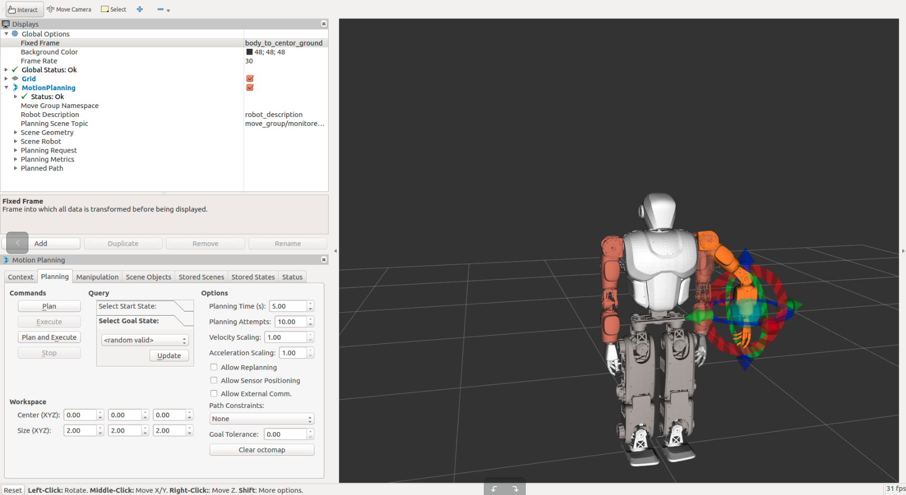

# MoveIt! 使用简介 #

## MOVE IT ##
[MoveIt!](http://moveit.ros.org/)提供了规划的坐标点变换到关节空间次序变换的工具。并且在ROS的基础上提供了丰富的软件功能。
本文档将协助你在快速的将MoveIt!应用到Arobot的双臂上。

## 安装 ##

请根据你使用的ROS版本安装moveit
[安装文档](http://moveit.ros.org/install/)

## Example ##

### 使用辅助GUI导入机器人生成MoveIt功能包 ###
参照官方网站的教程可以很容易的导出使用包，具体参照如下。
    [http://docs.ros.org/indigo/api/moveit_tutorials/html/doc/setup_assistant/setup_assistant_tutorial.html](http://docs.ros.org/indigo/api/moveit_tutorials/html/doc/setup_assistant/setup_assistant_tutorial.html)

我们将生成的配置文件放置在src/moveit_config下


### 控制双臂　###

#### 配置 ####

控制双臂跟正常控制机器人时相同，对于控制器的加载（同样是trajectory_controller）分为Gazebo和实机版。

**控制器配置**

文件:

    robot_control/core/arobot_hw/config/robot_arms_controller.yaml

    robot_control/core/arobot_hw/config/robot_arms_controller_position.yaml

其中前者为Gazebo后者为实机，唯一的区别就是控制器的类型不同（不过都是操控位置）。

```
arobot:
  # Publish all joint states -----------------------------------
  joint_state_controller:
    type: joint_state_controller/JointStateController
    publish_rate: 1000

  arobot_trajectory_controller:
    allow_partial_joints_goal: true
    type: position_controllers/JointTrajectoryController
    joints:
        - waist_pitch
        - waist_yaw
        # left leg
        - l_hip_yaw
        - l_hip_roll
        - l_hip_pitch
        - l_knee_pitch
        - l_ankle_roll
        - l_ankle_pitch
        # right leg
        - r_hip_yaw
        - r_hip_roll
        - r_hip_pitch
        - r_knee_pitch
        - r_ankle_roll
        - r_ankle_pitch
        # head
        - neck_yaw
        - neck_pitch

  left_arm_controller:
      allow_partial_joints_goal: true
      type: position_controllers/JointTrajectoryController
      joints:
          # left arm
          - l_shoulder_pitch
          - l_shoulder_roll
          - l_elbow_yaw
          - l_elbow_pitch
          - l_wrist_yaw

  right_arm_controller:
      allow_partial_joints_goal: true
      type: position_controllers/JointTrajectoryController
      joints:
          # right arm
          - r_shoulder_pitch
          - r_shoulder_roll
          - r_elbow_yaw
          - r_elbow_pitch
          - r_wrist_yaw
```

从配置中可知，我们把机器人简单的分成三部分，左臂，右臂以及剩余躯体。

**launch文件**

实体机器人：

    robot_control/core/arobot_hw/launch/arms_controller_main.launch

仿真：

    robot_gazebo/launch/robot_gazebo_arms.launch

**修改moveit_config中的文件**
1. 在config下增加controllers.yaml

```
controller_list:
 - name: /arobot/left_arm_controller
   action_ns: follow_joint_trajectory
   type: FollowJointTrajectory
   default: true
   joints:
        # left arm
    - l_shoulder_pitch
    - l_shoulder_roll
    - l_elbow_yaw
    - l_elbow_pitch
    - l_wrist_yaw
 - name: /arobot/right_arm_controller
   action_ns: follow_joint_trajectory
   type: FollowJointTrajectory
   default: true
   joints:
        # right arm
    - r_shoulder_pitch
    - r_shoulder_roll
    - r_elbow_yaw
    - r_elbow_pitch
    - r_wrist_yaw
```
2.　更改launch/robot_moveit_controller_manager.launch.xml

```
<launch>
    <!-- Set the param that trajectory_execution_manager needs to find the controller plugin -->
    <arg name="moveit_controller_manager" default="moveit_simple_controller_manager/MoveItSimpleControllerManager" />
    <param name="moveit_controller_manager" value="$(arg moveit_controller_manager)"/>
    <!-- load controller_list -->
    <rosparam file="$(find moveit_config)/config/controllers.yaml"/>
</launch>
```
3. 修改demo文件

将joint_state_publisher的`<rosparam param="/source_list">[/arobot/joint_states]</rosparam>`更改如下
``` 
<node name="joint_state_publisher" pkg="joint_state_publisher" type="joint_state_publisher">
    <param name="/use_gui" value="false"/>
    <rosparam param="/source_list">[/arobot/joint_states]</rosparam>
  </node>
```

将 `<arg name="fake_execution" value="true"/>`中的true改成false
```
<node name="joint_state_publisher" pkg="joint_state_publisher" type="joint_state_publisher">
    <param name="/use_gui" value="false"/>
    <rosparam param="/source_list">[/arobot/joint_states]</rosparam>
  </node>
  <!-- Run the main MoveIt executable without trajectory execution (we do not have controllers configured by default) -->
  <include file="$(find moveit_config)/launch/move_group.launch">
    <arg name="allow_trajectory_execution" value="true"/>
    <arg name="fake_execution" value="false"/>
    <arg name="info" value="true"/>
    <arg name="debug" value="$(arg debug)"/>
  </include>
```

#### 运行 ####

- Gazebo

    roslaunch robot_gazebo robot_gazebo_arms.launch
    
- 实体机

    roslaunch arobot_hw arms_controller_main.launch 
    

之后运行后
    
    roslaunch moveit_config demo.launch

就可以使用Rviz控制机器人双臂的例子了。


